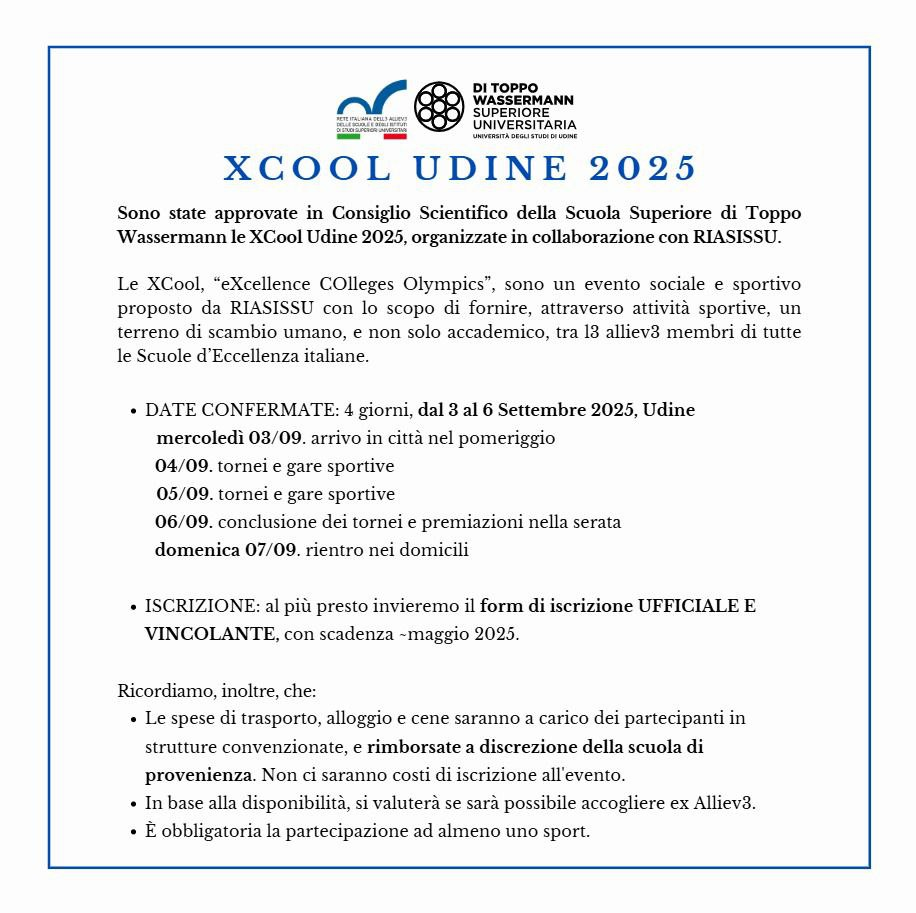

# Presentazione

XCool, “eXcellence COlleges Olympics” è un evento sociale e sportivo proposto dalla RIASISSU. Lo scopo dell’evento è fornire, attraverso attività sportive, un terreno di scambio umano, e non solo accademico, tra gli allievi membri di tutte le scuole di eccellenza Italiane.  Le XCool, infatti, evidenziano la centralità che le attività collaterali allo studio (come lo sport) hanno all’interno delle Scuole. È importante sottolineare che l’aspetto fondamentale di questo evento non sta nella pura competizione sportiva, bensì nel clima di cordialità, di incontro e di scambio tra i partecipanti. Le XCool cercano quindi di fornire agli allievi della Rete un momento di incontro che permetta agli studenti di arricchire anche il loro bagaglio umano mettendosi in gioco e confrontandosi con altre realtà. 

# Quando?

Dal **3 al 6 Settembre 2025**.

